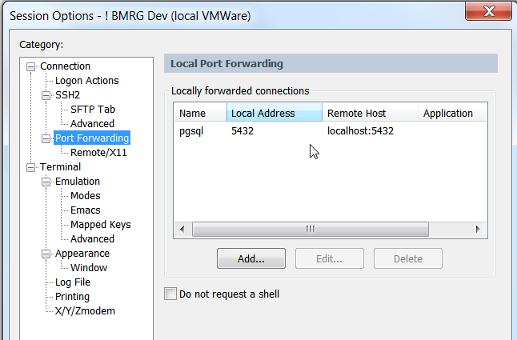
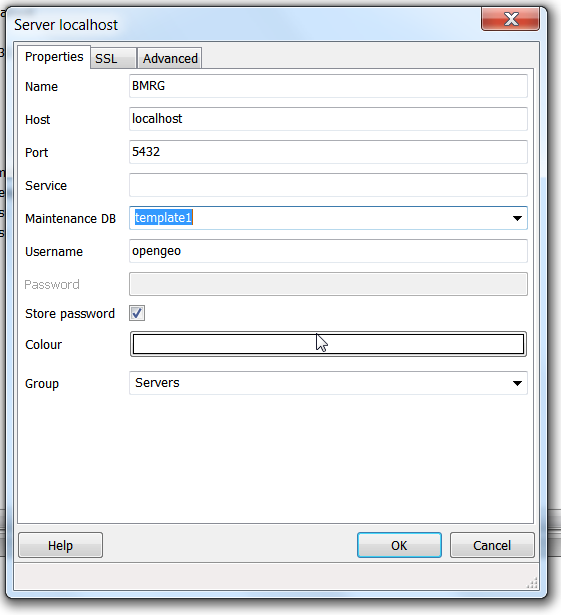

# Admin postgresql securely with pgadminIII via SSH  #

  **install pgadminIII**

[`http://www.pgadmin.org/download/](`http://www.pgadmin.org/download/)

  **install SecureCRT**

[http://www.vandyke.com/download/index.html](http://www.vandyke.com/download/index.html)

  **create a SSH tunnel for port 5432**

  **connect to posgresql with pgadmin**

note: if you need to access more than 1 pgsql, change the port numbers for the SSH tunnel & pgadminIII connection, eg 5433

