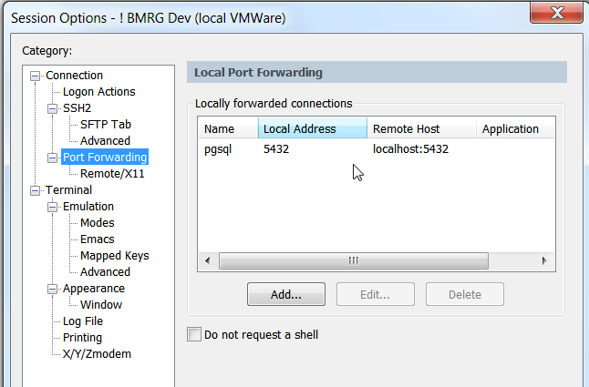
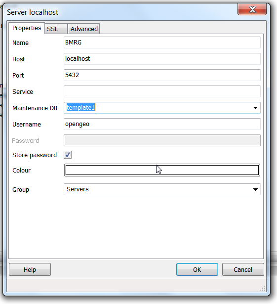

#Admin Postgresql securely on Windows with pgAdminIII via SSH#

  **(1) install pgadminIII**

[http://www.pgadmin.org/download/](http://www.pgadmin.org/download/)

  **(2) install SecureCRT**

[http://www.vandyke.com/download/index.html](http://www.vandyke.com/download/index.html)

  **(3) create a SSH tunnel for port 5432**

  **(4) connect to posgresql with pgadmin**

note: if you need to access more than 1 pgsql, change the port numbers for the SSH tunnel & pgadminIII connection, eg 5433

