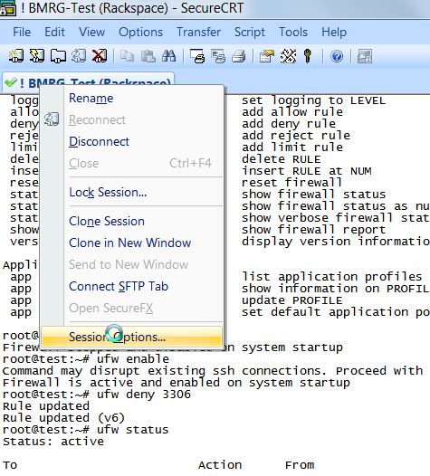

# Secure Connection to the Server #
 
**Open ports**

only 3 ports are open to the public, limiting attack vectors
80 - http.. web traffic
443 - https.. secure web traffic
22 - SSH.. command line connection, tunnelling & file trasfers (SFTP)

 
**Setup SSH on Ubuntu**

	apt-get install openssh-server
 
**Setup SSH on Windows**

Purchase Bitvise SSHD & follow their online instructions

## Clientside Setup (Windows) ##

 
**Filezilla - file transfers**

.. extremely simple/intuitive.. see Filezilla online docs if you're stuck

 
**SecureRT - command line & ad hoc tunneling**

Buy the software - [http://www.vandyke.com/products/securecrt/](http://www.vandyke.com/products/securecrt/ "http://www.vandyke.com/products/securecrt/")

 
**Bitvise Tunnelier - persistant tunneling**
